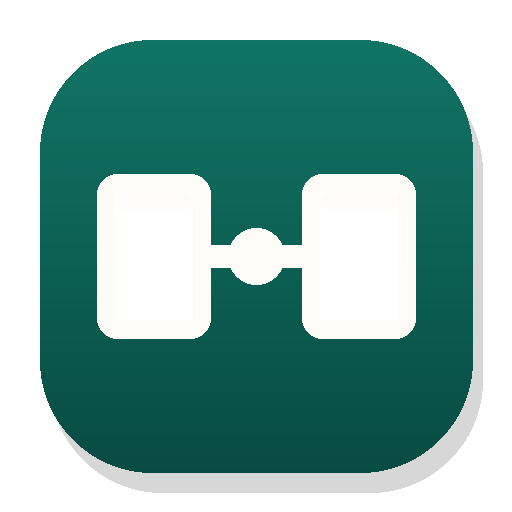
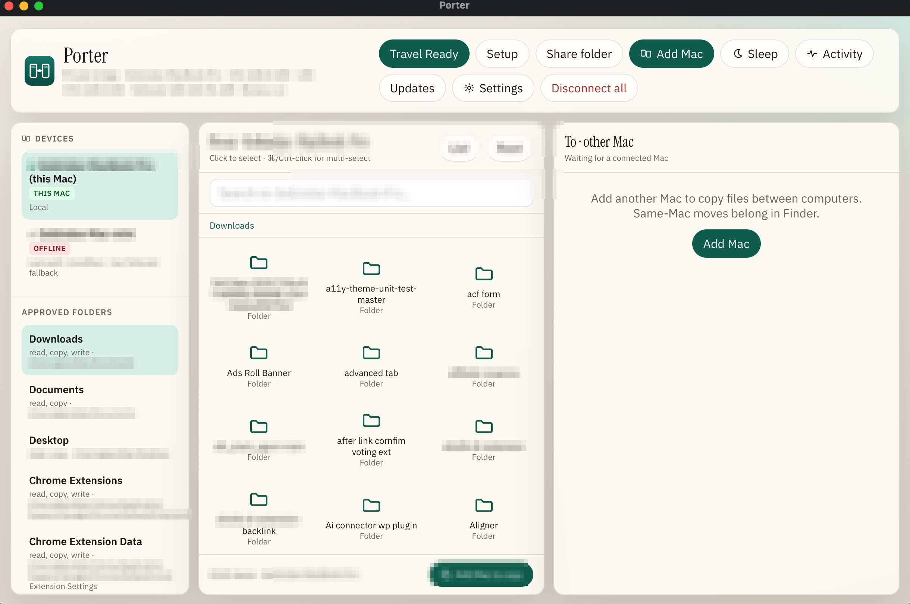
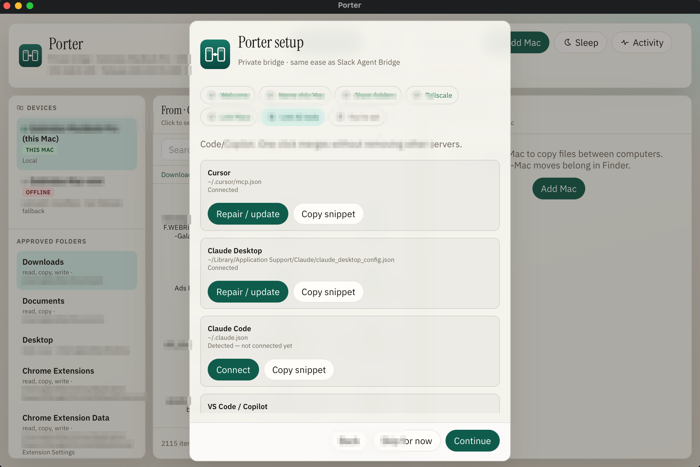
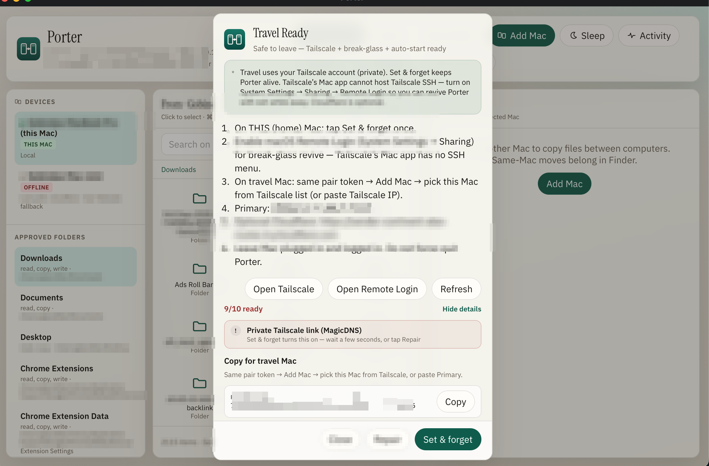
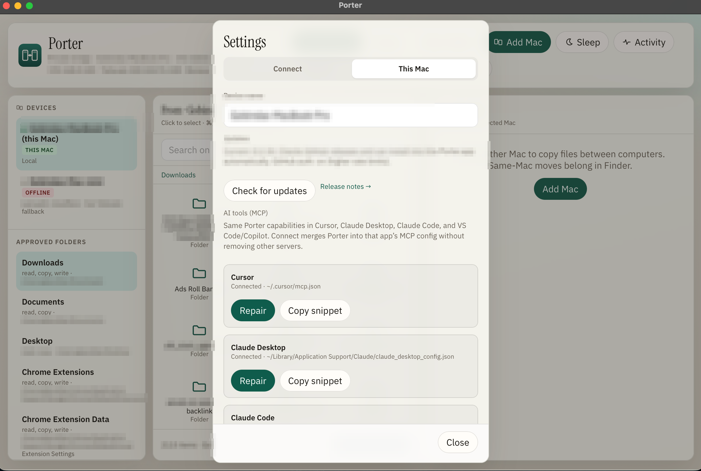
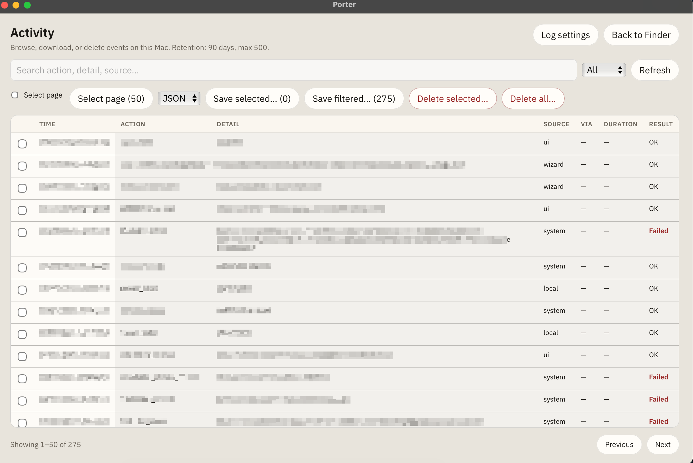

<p align="center">
  
</p>

<h1 align="center">Porter</h1>

<p align="center">
  <strong>Copy folders between your Macs like Finder</strong><br />
  Also on <strong>Windows x64 (preview)</strong>. Home Wi‑Fi, internet, or travel abroad (Tailscale). Then optional Cursor / Claude / Copilot via MCP.<br />
  No Porter cloud. Not remote desktop.
</p>

<p align="center">
  <a href="https://gtarafdar.github.io/porter/"></a>
  <a href="https://github.com/Gtarafdar/porter/releases/latest"></a>
  <a href="https://github.com/Gtarafdar/porter/stargazers"></a>
  <a href="LICENSE"></a>
  
  
</p>

<p align="center">
  <a href="https://github.com/Gtarafdar/porter/releases/latest/download/Porter-0.2.36-mac-arm64.dmg"><strong>⬇ Mac DMG</strong></a>
  ·
  <a href="https://github.com/Gtarafdar/porter/releases/latest/download/Porter-0.2.36-mac-arm64.zip"><strong>Mac Zip</strong></a>
  ·
  <a href="https://github.com/Gtarafdar/porter/releases/download/v0.2.35/Porter-Setup-0.2.35-windows-x64.exe"><strong>Windows Setup</strong></a>
  ·
  <a href="https://gtarafdar.github.io/porter/#download">Site downloads</a>
  ·
  <a href="https://github.com/Gtarafdar/porter">★ Star</a>
  ·
  <a href="https://gtarafdar.com/donate">Donate</a>
</p>

---

## Why Porter

Your projects live on one Mac. You (and your AI IDE) work on another. Cloud drives are clumsy for agents. Remote desktop gives more power than you need.

**Porter** is the narrow path: share only approved folders, browse them like Finder, and let AI tools use the same bridge through MCP over LAN or Tailscale.

| Need | Porter |
| --- | --- |
| Copy project files home ↔ travel | Dual-pane Finder UI, push copy, one-way sync |
| AI search / read / copy across Macs | MCP for Cursor, Claude Desktop, Claude Code, VS Code/Copilot |
| Desk + travel networking | Same Wi‑Fi LAN, or Tailscale mesh when away |
| See what happened | Activity log (search, export, retention, delete) |
| Optional Chrome setup move | Extension code + local extension data ([CHROME.md](CHROME.md)) |

**Not TeamViewer.** Remote desktop remotes a computer. Porter bridges **approved files** (and your AI tools).

---

## Download (Mac)

Prefer the **DMG** (drag Porter → Applications). Zip is for in-app updates.

> **Apple Silicon (M1/M2/M3/M4):** [Porter DMG](https://github.com/Gtarafdar/porter/releases/latest/download/Porter-0.2.36-mac-arm64.dmg) · [Zip](https://github.com/Gtarafdar/porter/releases/latest/download/Porter-0.2.36-mac-arm64.zip)  
> **All releases:** https://github.com/Gtarafdar/porter/releases  
> **Product site** (Mac + Windows chooser): https://gtarafdar.github.io/porter/#download

### First open (Gatekeeper)

Porter is MIT and distributed from GitHub. It is **not Apple-notarized**. That is normal for many indie Mac apps. It does **not** mean Porter is malware.

1. Open the DMG → drag **Porter** to **Applications** → eject  
2. Right-click Porter → **Open** → Open  
3. If still blocked: System Settings → Privacy and Security → **Open Anyway**

Then: install Tailscale (travel) → share folders → pair Macs → optional **Link AI tools**.

---

## Download (Windows preview)

Separate Setup EXE — does **not** replace the Mac DMG or Mac Latest release.

> **Windows x64:** [Porter Setup EXE](https://github.com/Gtarafdar/porter/releases/download/v0.2.35/Porter-Setup-0.2.35-windows-x64.exe)  
> Installs to `C:\Program Files\Porter` (UAC once; optional Private firewall for TCP 47831).  
> Guide: [Windows site page](https://gtarafdar.github.io/porter/windows.html) · [docs/WINDOWS.md](docs/WINDOWS.md) · Smoke: [docs/WINDOWS-SMOKE.md](docs/WINDOWS-SMOKE.md) · Downloads: https://gtarafdar.github.io/porter/#download

If SmartScreen appears: **More info → Run anyway** (unsigned indie build, same idea as Mac Gatekeeper).

Use the **same pair token** and Tailscale account as your Macs for Mac↔Windows and Windows↔Windows.

---

## Screenshots

<p align="center">
  
</p>

<p align="center">
  
  
</p>

<p align="center">
  
  
</p>

More on the [site gallery](https://gtarafdar.github.io/porter/#gallery). Sensitive details are redacted in public shots.

---

## Features

- **Finder-like dual pane** with search, multi-select, copy progress  
- **Approved folder shares** via native Choose folder…  
- **Pair token** (no Porter account) + Add Mac (LAN / Tailscale / optional Cloudflare)  
- **Remove Mac** with soft-forget  
- **Travel Ready / Set and forget** keep-alive, Tailscale Serve, Remote Login break-glass  
- **Push copy** and **one-way sync**  
- **Activity log** management (categories, retention, export, delete)  
- **AI / MCP** one-click for Cursor, Claude Desktop, Claude Code, VS Code  
- **Chrome** optional: Extensions + Local Extension Settings (not passwords/cookies)  
- **In-app updates** from GitHub Releases  

Deep docs: [CONNECTING.md](CONNECTING.md) · [CHROME.md](CHROME.md) · [docs/PRODUCT.md](docs/PRODUCT.md)

---

## AI tools (MCP)

One `mcp.js`, same capabilities for every host:

| Client | Config |
| --- | --- |
| Cursor (recommended) | `~/.cursor/mcp.json` |
| Claude Desktop | `~/Library/Application Support/Claude/claude_desktop_config.json` |
| Claude Code | `~/.claude.json` |
| VS Code / Copilot | `~/Library/Application Support/Code/User/mcp.json` (`servers` + stdio) |

In the app: Setup → **Link AI tools**, or Settings → This Mac → **AI tools**.

---

## Security and privacy

| Layer | Role |
| --- | --- |
| Tailscale account | Who can reach the Mac (travel) |
| Pair token | What Porter allows after connect |
| Folder allowlists | Which paths may be listed / copied |
| Secret-path blocks | `.env`, keys, dangerous profiles blocked by default |

Settings stay localhost-only. Confirm writes default on. Activity log is visible.

Honest residual risk: allowlisted folders are readable by a connected agent or peer with your token.

- Site: [Privacy](https://gtarafdar.github.io/porter/privacy.html) · [Security](https://gtarafdar.github.io/porter/security.html)  
- Repo: [SECURITY.md](SECURITY.md)

---

## Limitations

- No iPhone / iPad app in this version  
- No Apple ID auto-discovery  
- No two-way sync with conflict UI  
- Mac release line is **Apple Silicon**  
- Windows is **x64 preview** (unsigned Setup EXE; ARM later)  
- Not Mac App Store / not notarized (right-click → Open)  
- Reliable travel needs **Tailscale** (not bundled)  
- Strongest unattended home path remains **Mac Travel Ready**

---

## About the maker

<p align="center">
  
</p>

**Gobinda Tarafdar** — WordPress product marketer · stubborn problem-solver · lifelong Harry Potter devotee

Product Marketing Specialist at [WPBakery](https://wpbakery.com/). Porter is part of a personal workshop of local-first tools.

| | |
| --- | --- |
| GitHub | https://github.com/Gtarafdar |
| X / Twitter | https://x.com/Gtarafdarr |
| LinkedIn | https://www.linkedin.com/in/gobinda-tarafdar/ |
| Donate | https://gtarafdar.com/donate |
| Site | https://gtarafdar.github.io/porter/ |

### Also from the workshop

| Project | Description |
| --- | --- |
| [Aligner](https://gtarafdar.github.io/aligner/) | Free local Chrome toolkit for design, measure, WordPress |
| [FinderFlow](https://gtarafdar.github.io/FinderFlow/) | Mac file manager with built-in editor |
| [Slack Agent Bridge](https://gtarafdar.github.io/slack-agent-bridge/) | MCP bridge for Cursor / Claude |
| [Auto AFK Slack](https://gtarafdar.github.io/auto-afk-slack/) | Lock your Mac, Slack goes AFK |
| [Slack Teammate Time](https://gtarafdar.github.io/slack-teammate-local-time/) | Teammate local times in Slack |
| [Broken Link Checker](https://gtarafdar.github.io/broken-link-checker/) | Broken links without leaving the page |
| [Docscriber](https://thedocscriber.com/) | Documentation, conjured |
| [TheRecaller](https://therecaller.com/) | Memory for what you forget online |
| [TheEditra](https://theeditra.com/) | AI video editor |
| [The Quill Press](https://thequillpress.com/) | Tech news |
| [Costlas](https://costlas.com/) | Cost of living for 140+ countries |

If Porter helps you, please **[★ Star the repo](https://github.com/Gtarafdar/porter)** or [Donate](https://gtarafdar.com/donate).

---

## Develop (optional)

```bash
npm install && npm run build
npm start
```

Config: `~/.porter/` (mode 0600). See [CONTRIBUTING.md](CONTRIBUTING.md).

---

## License

[MIT](LICENSE) © Gobinda Tarafdar
