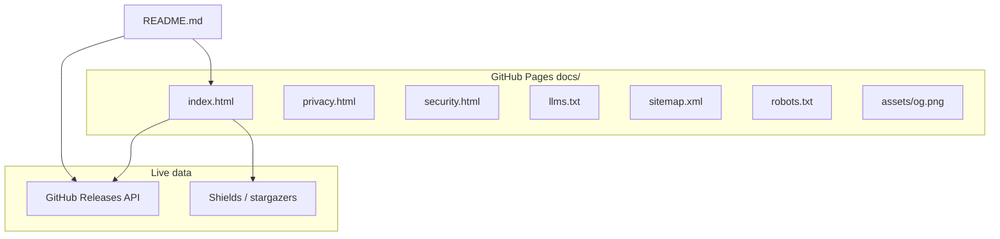

# Porter landing page + GitHub README + Pages

## Goal

Ship a distinctive, lightweight marketing site on GitHub Pages plus a professional README. Present Porter completely: product story, features, screenshots, FAQ, download, changelog, security/privacy/license, creator profile, workshop projects, star and donate. No AI slop. No em dashes in copy.

## Decisions (locked)

| Choice | Decision |
| --- | --- |
| Host | GitHub Pages from **`main` / `docs`** (same as Aligner) → `https://gtarafdar.github.io/porter/` |
| Stack | **Vanilla** `docs/index.html` + CSS + small JS (no React build) |
| Brand | Porter tokens: Instrument Serif + IBM Plex Sans, ink `#1c1915`, accent `#0f5c4c`, warm paper ground, **liquid glass** panels |
| Copy | From `docs/LANDING.md` + `docs/PRODUCT.md`; **no em dashes**; SEO-first headings |
| Releases | Fetch GitHub Releases API for download CTAs + changelog tree |
| Screenshots | `docs/images/public-safe/` only |
| Icon | `apps/desktop/public/icons/` (`porter-512.png`, favicon, apple-touch) |
| Maker | `docs/images/gobinda-tarafdar.png` + workshop links from LANDING.md |

## Architecture



## Site file layout

```text
docs/
  index.html
  privacy.html
  security.html
  llms.txt
  robots.txt
  sitemap.xml
  assets/
    css/site.css
    js/site.js
    img/          # icons, og, public-safe screenshots, maker photo
  PRODUCT.md, LANDING.md, SCREENSHOTS.md  # keep; link from site
```

Enable Pages: branch `main`, folder `/docs`. Set repo Homepage to `https://gtarafdar.github.io/porter/` and topics (`macos`, `mcp`, `tailscale`, `finder`, `private-ai`).

## Landing section order

Sticky side rail (desktop) + compact top nav (mobile), hash links, `aria-current`:

1. Skip link + header  
2. Hero: centered Porter mark, brand-led title, DMG CTA (version via JS), Zip + GitHub, Gatekeeper one-liner, glass chip  
3. Problem / not TeamViewer: interactive compare cards  
4. Screenshot filmstrip: public-safe shots in glass frames + lightbox  
5. How it works: scroll-linked steps (`prefers-reduced-motion` safe)  
6. Features: interactive glass/bento cards with detail expand  
7. AI / MCP: IDE matrix  
8. Security and privacy summary + deep links  
9. Download: live version, DMG/Zip from API, Apple Silicon note, Gatekeeper steps  
10. Changelog tree: last N releases  
11. FAQ accordion  
12. Creator: photo, about, socials, donate, star, workshop grid  
13. Star + donate band  
14. Footer: MIT, privacy, security, CONNECTING, releases, socials  

Motion: scroll reveal, glass specular on pointer, card expand only. No emoji storms, no purple neon.

## SEO / crawl / AI / OG

- Title, description, canonical  
- Open Graph + Twitter Card → `assets/img/og.png` (1200×630)  
- JSON-LD `SoftwareApplication` + `Person`  
- One H1, logical H2/H3  
- `llms.txt`, `sitemap.xml`, `robots.txt`  

## Release sync

```text
GET /repos/Gtarafdar/porter/releases/latest
GET /repos/Gtarafdar/porter/releases?per_page=12
```

Map `arm64.dmg` / `arm64.zip`; fallback hardcoded `releases/latest/download/…` pattern if API fails.

## README rewrite

Centered icon; pitch; badges (release, stars, license, Pages); latest download links; public-safe screenshots; is/is-not; features; MCP; travel; security/privacy; limitations; maker + photo + socials + donate + star; workshop table; MIT; link to Pages site.

## Repo checklist

- Commit site + README + assets  
- Enable Pages `main`/`/docs`  
- Set homepage + topics  
- Smoke-test Pages URL, anchors, download buttons, OG image URL  

## Anti-slop

- No em dashes in new copy  
- Brand “Porter” is the hero signal  
- Screenshots dominate visually; not tiny inset hero cards  
- Honest Gatekeeper FAQ: not malware; right-click Open is normal for indie MIT  

## Implementation order

1. Scaffold `docs/assets`  
2. `site.css` + `index.html`  
3. Releases JS + changelog  
4. privacy/security/llms/robots/sitemap + meta  
5. README rewrite  
6. Enable Pages + smoke test  

## Out of scope this pass

Custom domain, notarization, Intel rebuild, Aligner site changes.
